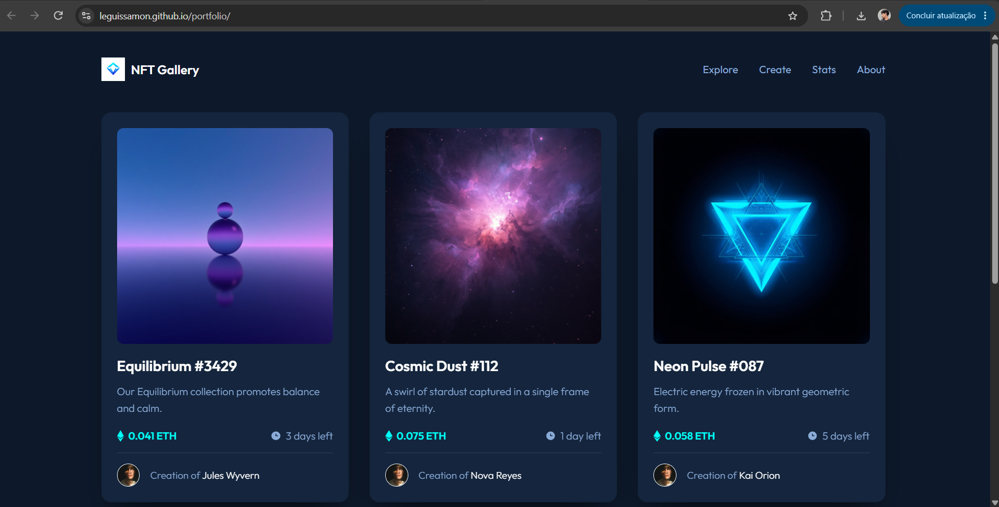

## Portfolio 

Projeto desenvolvido em grupo como parte do Desafio Portfólio 1.0, evoluindo um componente de card de NFT (Frontend Mentor) até uma galeria completa com header navegável.

## Links

- Site publicado: https://leguissamon.github.io/portfolio/
- Repositório: https://github.com/leguissamon/portfolio

##  Tecnologias

- HTML5
- CSS3 (Flexbox, Grid, Media Queries, Custom Properties)
- JavaScript (vanilla)
- [Animate.css](https://animate.style/) para animações de entrada
- [Leonardo.ai](https://app.leonardo.ai/) para geração de imagens e logo com IA
- GitHub Pages para hospedagem

## Funcionalidades

- **Fase 1.0 — CardNFT**: card de preview de NFT seguindo o design do [Frontend Mentor](https://www.frontendmentor.io/challenges/nft-preview-card-component-SbdUL_w0U), com efeito de hover na imagem e no título
- **Fase 1.1 — CardList**: lista responsiva com 4 cards de NFT, imagens geradas por IA e animações de entrada escalonadas
- **Fase 1.2 — Header**: cabeçalho com logo criada por IA, navegação responsiva e menu hambúrguer para mobile

## Responsividade

Layout construído mobile-first com CSS Grid (`auto-fit`/`minmax`) e media queries, garantindo boa visualização em celular, tablet e desktop.

##  Screenshots

## 👥 Autores

- Kauã Leguissamon da Silva
- Raul Babeto Barbosa
- João Gabriel Barz

